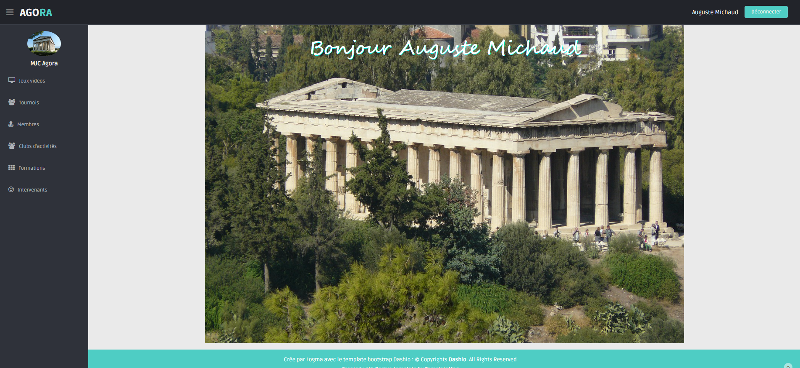

# Projet Agora - MJC Libreville

Ce projet est une application web développée pour la **MJC Agora** de Libreville par l'ESN **Logma**. Il s'agit d'une refonte complète de leur système d'information, passant d'un site statique/PHP natif à une application moderne basée sur le framework **Symfony**.

## 🚀 État d'avancement (Mission 6.1)

Le projet a évolué au fil des différentes missions confiées à l'équipe de développement :

1.  **Mission 3 - Intégration de Twig** :
    *   Séparation de la logique métier et de la présentation.
    *   Utilisation du moteur de template **Twig** pour des vues plus claires et maintenables.

2.  **Mission 4 - Passage à Symfony (Sprint 4)** :
    *   Adoption du framework **Symfony 7**.
    *   Mise en place de l'architecture **MVC** (Modèle-Vue-Contrôleur).
    *   Création des premières routes et contrôleurs.

3.  **Mission 5 - Persistance des données avec Doctrine** :
    *   Gestion de la base de données via l'ORM **Doctrine**.
    *   Création des Entités (JeuVideo, Tournoi, etc.) et des relations.
    *   Utilisation des Migrations pour versionner le schéma de base de données.

4.  **Mission 6 - Sécurité et Gestion des Membres (Actuel)** :
    *   Mise en place du composant **Security** de Symfony.
    *   Création de l'entité `Membre` (User).
    *   Système d'authentification (Connexion/Déconnexion).
    *   Gestion des rôles (`ROLE_USER`, `ROLE_ADMIN`).
    *   Protection des routes (CRUD Membre réservé aux administrateurs).
    *   Hachage des mots de passe.

---

## 🛠️ Installation et Démarrage

Pour récupérer et lancer le projet sur votre machine locale, suivez ces étapes :

### 1. Pré-requis
*   PHP 8.2 ou supérieur
*   Composer
*   Serveur MySQL ou MariaDB (ex: XAMPP, WAMP)
*   Symfony CLI (recommandé)

### 2. Installation des dépendances
Récupérez les bibliothèques PHP nécessaires (Vendor) qui ne sont pas incluses dans le dépôt Git :

```bash
composer install
```

### 3. Configuration de la Base de Données
1.  Dupliquez le fichier `.env` et renommez-le en `.env.local` (si ce n'est pas déjà fait).
2.  Modifiez la ligne `DATABASE_URL` pour correspondre à vos identifiants locaux :

```dotenv
# .env.local
DATABASE_URL="mysql://root:@127.0.0.1:3306/agoraorm?serverVersion=10.4.32-MariaDB"
# Adaptez 'root' (user) et '' (mot de passe) selon votre configuration XAMPP/WAMP
```

3.  Créez la base de données et mettez à jour le schéma :

```bash
php bin/console doctrine:database:create
php bin/console doctrine:schema:update --force
```

### 4. Chargement des Données de Test (Fixtures)
Pour pouvoir vous connecter, vous devez générer les utilisateurs de test. Nous utilisons `Faker` pour générer des données réalistes.

```bash
php bin/console doctrine:fixtures:load
```
> **Note** : Cette commande vide la base de données et recrée les jeux de données. Tapez 'yes' quand demandé.

---

## 🔐 Connexion et Identifiants

Une fois les fixtures chargées, vous disposez de plusieurs comptes de test.

### Compte Administrateur
Ce compte a accès à tout le site, y compris la gestion des membres (Menu "Membres").

*   **Identifiant** : `Lecoq` (ou le nom de famille associé à l'email `userdemo0@exemple.com` dans votre base de données)
*   **Mot de passe** : `userdemo`

### Compte Utilisateur Standard
Ce compte a accès au site mais ne voit pas le menu "Membres".

*   **Identifiant** : N'importe quel autre nom de famille généré (voir table `membre`).
*   **Email** : `userdemo1@exemple.com` (pour retrouver le login en base).
*   **Mot de passe** : `userdemo`

---

## 💻 Commandes Utiles

*   **Lancer le serveur de développement** :
    ```bash
    symfony serve -d
    # ou
    php -S 127.0.0.1:8000 -t public
    ```

*   **Créer un nouvel utilisateur (si besoin)** :
    Vous pouvez utiliser le formulaire d'inscription (si développé) ou modifier les fixtures dans `src/DataFixtures/MembreFixtures.php`.

*   **Vider le cache** (en cas de problème d'affichage) :
    ```bash
    php bin/console cache:clear
    ```

---

## 📂 Structure du Projet (Simplifiée)

*   `config/` : Configuration de Symfony (routes, services, security...).
*   `src/` : Code source PHP.
    *   `Controller/` : Les contrôleurs (pages).
    *   `Entity/` : Les classes correspondant aux tables de la BDD.
    *   `Form/` : Les formulaires (ex: MembreType).
    *   `Repository/` : Requêtes SQL personnalisées via Doctrine.
    *   `Security/` : Gestion de l'authentification (`LoginFormAuthenticator`).
*   `templates/` : Vues Twig (`.html.twig`).
    *   `security/` : Page de connexion.
    *   `membre/` : CRUD des membres.
